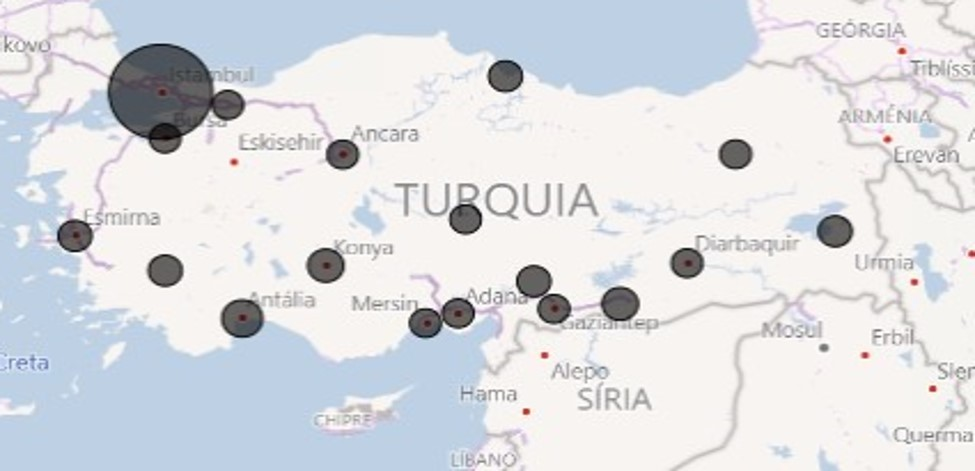
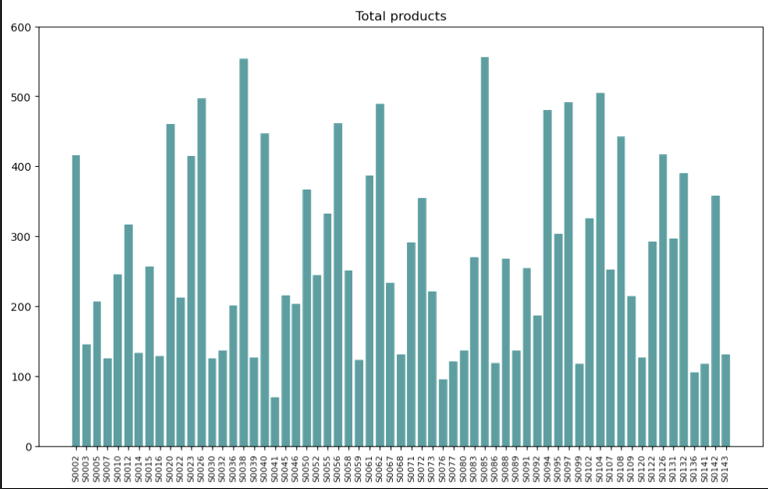
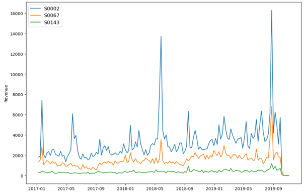
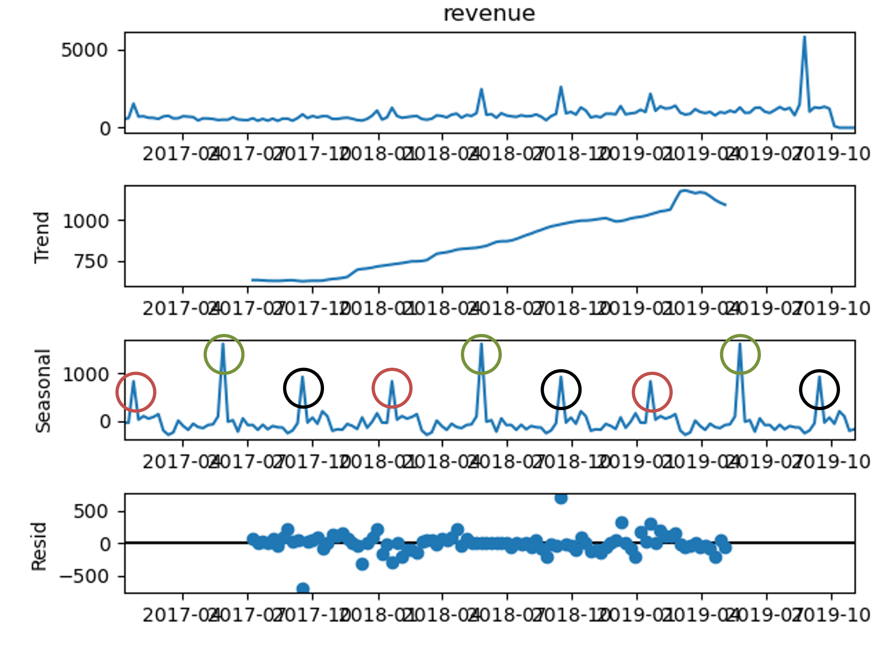
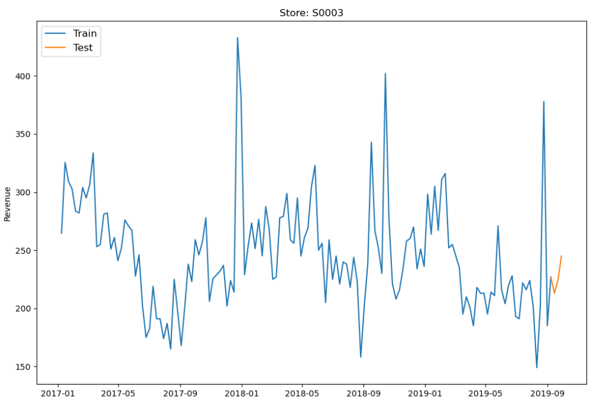
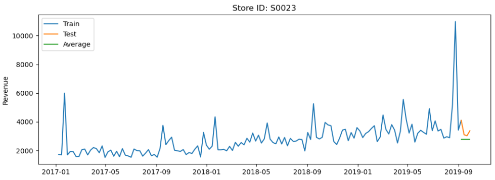
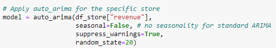

# Time series prediction

Description: 
- Revenue forecast using: simple average, arima, arimax and sarimax models
- PCA in order to reduce the number of store IDS
- Hierarchical clustering using the selected PC

### Part I: Revenue forecast for the 5 upcoming weeks 

**Datasets**

All the datasets used can be found below:

-
-
-

The CRISP DM methodology has been used throughout the report:

- Business/Data Understanding
- Data Preparation
- Modeling
- Evaluation
- Forecast

Each step is briefly described as follows:

**1) Business/Data understanding**

As mentioned above, there are 3 datasets with a csv extension:

- Sales (14 columns in total):
  1. Unnamed column (PK);
  2. Store ID: ID of each store (FK);
  3. Product ID: ID of each product (FK);
  4. Date: date of each sale (yyyy-mm-dd format)
  5. Sales: number of sales
  6. Revenue: revenue of each sale
  7. Stock
  8. Price
  9. Promo columns: promo_type_1, promo_bin_1, promo_type_2, promo_bin_2, promo_discount_2, promo_discount_type_2

- Cities (6 columns in total):
  1. Store ID (PK);
  2. Store type ID
  3. Store size
  4. City old ID
  5. Country ID
  6. City code 

- Product (10 columns in total):
  1. Product ID (PK);
  2. Product length;
  3. Product depth;
  4. Prodcut width;
  5. Cluster ID
  6. Hierarchy: hierarchy1_id, hierarchy2_id, hierarchy3_id, hierarchy4_id and hierarchy5_id

After analysing all datasets, it can be deducted:
- There are **63** different stores located in Turkey;
  
  
- The sales dataset includes **daily** sales/revenue per store from January 2017 to September 2019;
  
  
- Total products and total revenue vary between stores:
  
  
  

**2) Data Preparation**

- In order to reduce the number of rows (8886058), sales dataset has been grouped to weekly revenue (8610 rows).  

  

- Seasonal Decomposition

  A time series can exhibit a variety of patterns. It is helpful to split the time series into several components, each representing a pattern category. 
  Below is shown the seasonal composition for Store ID S0003:

  
  
  There is a steady upward trend over the years and a clear seasonal pattern.

- Train vs. Test

  Before we start modelling, we need to split our dataset into training and test:

  - **Training**: 140 weeks
  - **Test**: 4 weeks
  
  

  **3) Modeling**

  Four different models have been used to forecast revenue for the next 5 weeks:

    1. Simple average
    
       All future values are equal to the average of the historical data. 
  
       

    2. Arima (auto-arima)

       An ARIMA model is characterized by 3 terms: p, d, q:

       - p is the order of the AR term
       - q is the order of the MA term
       - d is the number of differencing required to make the time series stationary
      
       Auto arima uses a stepwise approach to search multiple combinations of p,d,q parameters and chooses the best model that has the least AIC.

       

       Parameters considered:
         - y: the time-series to which to fit the ARIMA estimator (Revenue column)
         - seasonal: False (not considering seasonality)
         - suppress_warnings: True
         - random_state: Equals to 20 (Ensures replicable testing and results)
         - stepwise: default = True (Whether to use the stepwise algorithm outlined in Hyndman and Khandakar (2008) to identify the optimal model parameters)
         - method: default = 'lbfgs' (The method determines which solver from scipy.optimize is used - ‘lbfgs’ for limited-memory BFGS with optional box constraints)
         - start_p: defalut = 2 (order (or number of time lags) of the auto-regressive (“AR”) model)
         - start_q: default = 2 (order of the moving-average (“MA”) model)
         - d: default=None (If None, the value will automatically be selected based on the results of the test (i.e., either the Kwiatkowski–Phillips–Schmidt–Shin, Augmented Dickey-Fuller or the 
           Phillips–Perron test will be conducted to find the most probable value)
         - max_p: default = 5 (The maximum value of p, inclusive)
         - max_d: default = 2 (The maximum value of d, or the maximum number of non-seasonal differences)
         - max_q: default = 5 (The maximum value of q, inclusive)
         - test: default = 'kpss' (Type of unit root test to use in order to detect stationarity if stationary is False and d is None: Default is ‘kpss’ (Kwiatkowski–Phillips–Schmidt–Shin)

          
  

  
  
  
  
